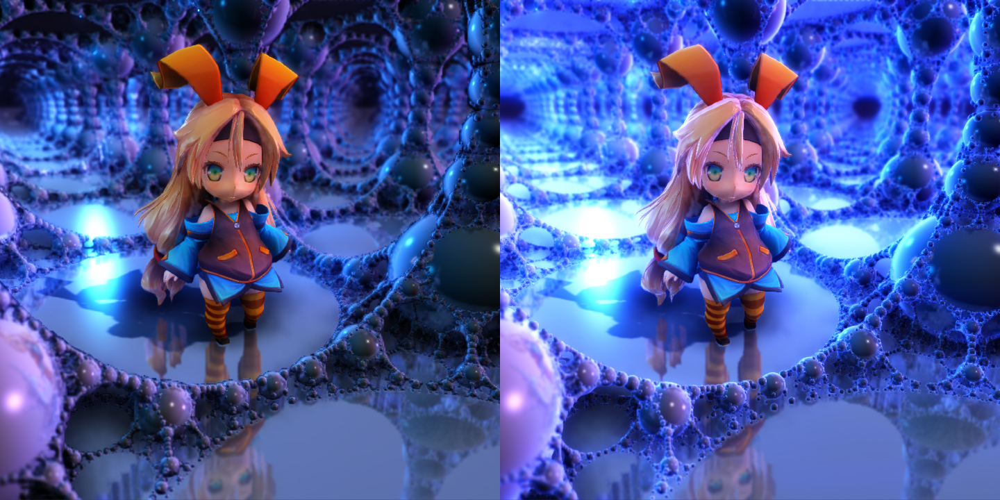
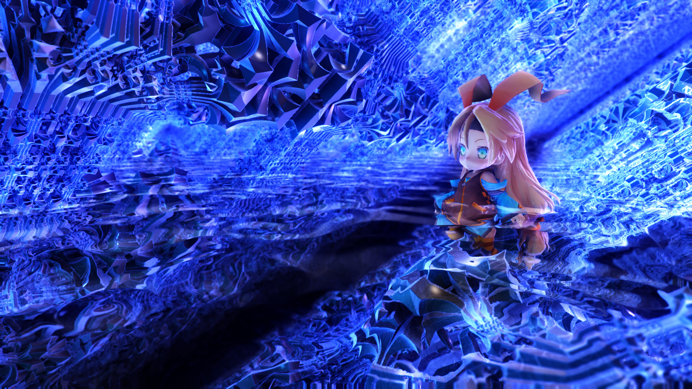

Unity5 Effects
============

Unity5 用エフェクト置き場。  
こちらのパッケージをインポートすれば大体そのまま使えます：[IstEffects.unitypackage](https://github.com/i-saint/Unity5Effects/raw/master/Packages/IstEffects.unitypackage)  
多くはレンダリングパスが deferred であることを前提としています。また、カメラが HDR モードである方がより望ましい結果になります。

### Temporal Screen Space Reflections
  
スクリーンスペース反射です。  
kode80 氏が[似たようなもの](https://github.com/kode80/kode80SSR)を公開していますが、そちらとはアルゴリズムが違い、
若干残像が残ってしまう欠点があるものの、圧倒的に高速でクオリティも引けを取りません。  
実装の詳細に興味があれば[こちらの記事](http://i-saint.hatenablog.com/entry/2014/12/05/174706)もどうぞ。
また、上記スクリーンショットの背景は[こちら](https://github.com/i-saint/RaymarchingOnUnity5)の Raymarcher によるものです。

### Screen Space Shadows
  
G-Buffer をレイマーチすることで影を出せるライトです。点光源の他に線光源も扱えるようになっています。  
ライティング処理の大部分は<a href="http://blogs.unity3d.com/2015/02/06/extending-unity-5-rendering-pipeline-command-buffers/">公式の CommandBuffer のサンプルプロジェクト</a>から借用しています。

### Screen Space Boolean
  
G-Buffer 加工によるスクリーンスペースブーリアン演算です。  
重い、影を正しく処理できない、複雑な立体交差で破綻する、などいくつか問題はありますが、見た目に結構インパクトがある効果は得られます。  
実装の詳細に興味があれば[こちらの記事 (の下の方)](http://i-saint.hatenablog.com/entry/2014/07/25/001608)もどうぞ。

### Rim Light
  
法線と カメラ -> ピクセル位置 の角度が浅い部分を明るくするアレです。

### Water Surface & Caustics Field
  
水面とコースティクスです。  
水面は G-Buffer をレイマーチすることで屈折をエミュレートしています。コースティクスは 3 次元ノイズで明るくしてそれっぽく見せかけています。

#### Mosaic Field
  
指定オブジェクトをモザイク領域化するシェーダです。

 This work is licensed under a <a rel="license" href="http://creativecommons.org/licenses/by/4.0/">Creative Commons Attribution 4.0 International License</a>.
