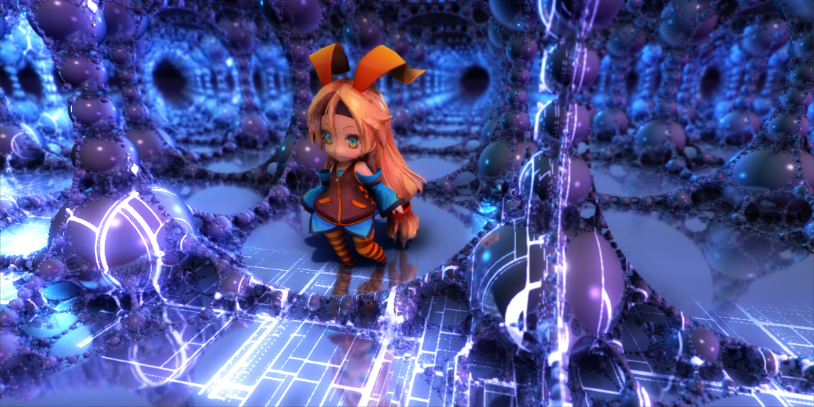
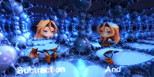
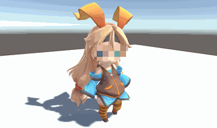

Unity5 Effects
============

Unity5 用に書いたエフェクト置き場。現在あるもの：  

### Temporal Screen Space Reflections
  
[ScreenSpaceReflections.unitypackage](https://github.com/i-saint/Unity5Effects/raw/master/Packages/ScreenSpaceReflections.unitypackage)  

スクリーンスペース反射です。  
kode80 氏が[似たようなもの](https://github.com/kode80/kode80SSR)を公開していますが、そちらとはアルゴリズムが違い、
若干残像が残ってしまう欠点があるものの、圧倒的に高速でクオリティも引けを取りません。  
実装の詳細に興味があれば[こちらの記事](http://i-saint.hatenablog.com/entry/2014/12/05/174706)もどうぞ。
また、上記スクリーンショットの背景は[こちら](https://github.com/i-saint/RaymarchingOnUnity5)の Raymarcher によるものです。

### Screen Space Boolean
  

G-Buffer 加工によるスクリーンスペースブーリアン演算です。  
現状 D3D11 でしかまともに動かない、影を正しく処理できない、複雑な立体交差で破綻する、などなど問題が山積みであり、
実用性は微妙ですが、とりあえず見た目に結構インパクトがある効果は得られます。  
実装の詳細に興味があれば[こちらの記事 (の下の方)](http://i-saint.hatenablog.com/entry/2014/07/25/001608)もどうぞ。

#### Mosaic Field
  
[Mosaic.unitypackage](https://github.com/i-saint/Unity5Effects/raw/master/Packages/Mosaic.unitypackage)  

指定オブジェクトをモザイク領域化するシェーダです。

 This work is licensed under a <a rel="license" href="http://creativecommons.org/licenses/by/4.0/">Creative Commons Attribution 4.0 International License</a>.
